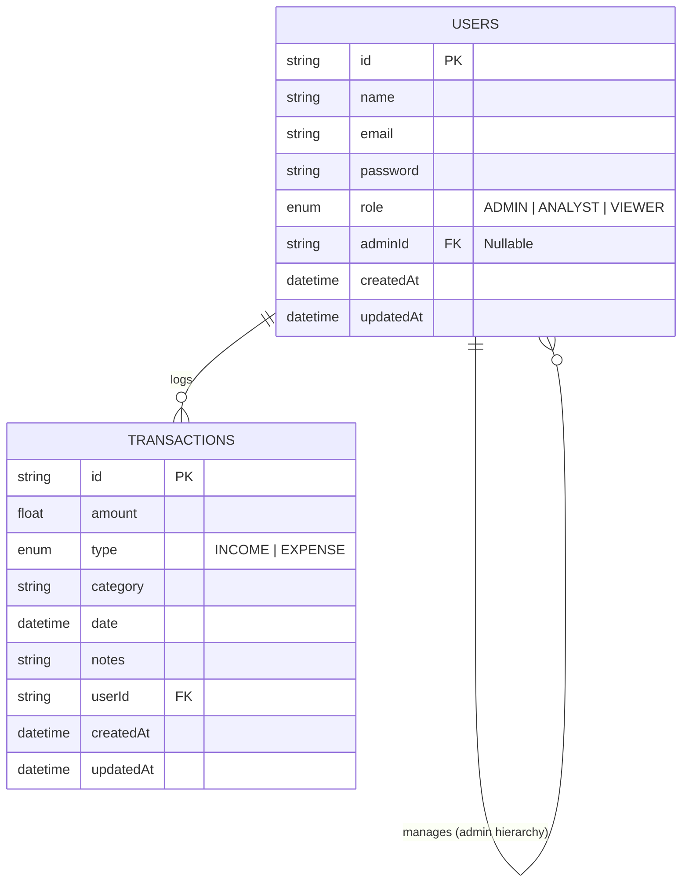
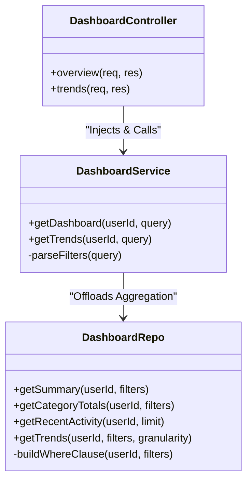

# 📊 Finance Analytics & Access Control System

A complete role-based financial management system. This software empowers businesses and individuals to securely track incomes, map out expenses, and visualize live analytical data across their organization. 

---

## 📖 Project Overview (For Non-Technical Users)

Imagine running a company where you need to track every dollar entering and leaving your operation, but you don't want everyone to have the same level of access.

This system guarantees that:
- **Viewers** can only gaze at the dashboards safely without touching the numbers.
- **Analysts** can dive deep into detailed records and generate insight trends.
- **Admins** have supreme control—they can add new transactions, fix mistakes, register new staff accounts, and oversee the entire financial ladder.

Behind the scenes, we crunch all that transaction data instantly to produce clean, high-level dashboards containing "Total Balances", "Category Spending Summaries", and "Weekly/Monthly Trends."

---

## ⚙️ Architecture (For Technical Users)

This project strictly adheres to the **Repository-Service-Controller** architectural pattern. 

Why? Because it cleanly separates:
1. **Controllers (HTTP Routing):** Simply takes the web requests and forwards them cleanly.
2. **Services (Business Logic):** Validates inputs, parses parameters, and orchestrates the app.
3. **Repositories (Database Logic):** Houses the raw SQL and Prisma ORM operations to aggregate data extremely fast natively on the database server.

### 🗄️ Entity-Relationship (ER) Diagram
This diagram outlines our robust database schema using Prisma / MySQL. We handle hierarchical management through a self-referencing User table (Admins manage subordinate Users).

### 🧩 Class Architecture Diagram
Here is a high-level representation of how data flows from the Web APIs down to the MySQL Database, using the `Dashboard` feature as a scalable example.

---

## 🛠️ Technology Stack

- **Backend Runtime:** Node.js + Express.js
- **Language:** Fully strictly typed TypeScript
- **Database Architecture:** MySQL (MariaDB compatible)
- **Object Relational Mapper (ORM):** Prisma 7 
- **Authentication:** Stateless JSON Web Tokens (JWT) & Bcrypt Encryption
- **Development Tooling:** tsx (Modern ESM/CJS runtime compiler)

---

## 🚀 Getting Started

If you are a developer looking to clone this project and test it out locally, please refer to our **[Settings & Installation Guide](./SETUP.md)**. It takes less than two minutes to run!

## 📘 API Documentation

For Frontend Developers looking to plug into this backend to build Mobile Apps or React Sites, please refer to our **[API Reference Guide](./API_GUIDE.md)** for a detailed list of all secure JSON endpoints and payload data.
